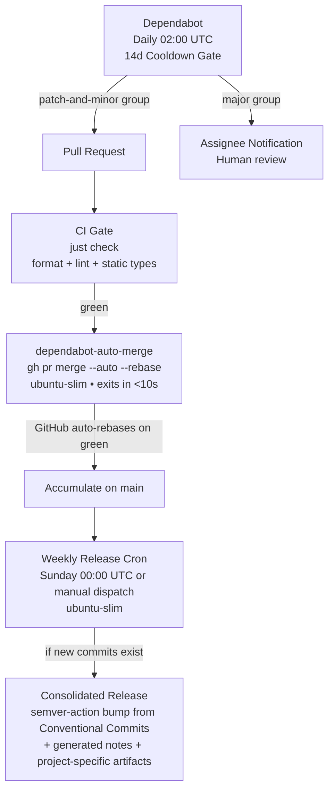

# Autonomous Upgrade

Autonomous dependency update and batched release pipeline: **Dependabot (daily + 14d cooldown) → `just check` CI Gate → Instant Auto-rebase (patch/minor) → Weekly Consolidated Release**.



## Customize Before You Apply (Strong Recommendation)

There is no one-size-fits-all CI/CD flow, and a project's needs change over
time, so treat everything below as a **baseline to adapt**, not a mandate.
Before creating or changing workflows, **run the discovery checklist with the
project owner, present a recommended option plus trade-offs for each decision,
and get their agreement.** Summarize the agreed decisions (and any deviations
from this skill) in the PR description/conversation — do not commit a decision
file.

Strong recommended defaults (confirm with the owner; deviate when the project
justifies it):

1. **Release model** — weekly batched release (Sunday 00:00 UTC) plus manual
   dispatch. Alternatives: release on every merge, label-gated releases.
2. **Version source of truth** — git tags;
   [`ietf-tools/semver-action`](https://github.com/ietf-tools/semver-action)
   derives the next version from the Conventional Commits since the latest tag
   (**never** a hand-rolled calculation or a manually typed version). If the
   binary must report its version, inject the action's output so `--version`
   matches the tag. Alternatives: `release-plz`/`release-please`.
3. **Release artifacts** — build only what the project ships; for CLIs, Linux
   x64 + Windows x64 + macOS arm64; notes-only otherwise. Confirm formats and
   publish targets (GitHub Releases, a registry, a Homebrew tap, a CDN).
4. **CI gate** — one `just check` gate on `ubuntu-latest`, no build matrix; add
   only the runtimes/services the check needs.
5. **Dependencies** — daily at 02:00 with a 14-day cooldown, grouped
   `patch-and-minor` vs `major`, open-PR limit 2, per ecosystem/directory.
6. **Security & config** — rebase-only + linear history + required
   `Check (just check)`; prefer the same-repo `GITHUB_TOKEN`; use a fine-grained
   PAT or GitHub App only for cross-repo sync; avoid polling loops.
7. **Downstream sync** — event-driven when a token is acceptable, otherwise a
   short-interval poll that pushes directly; confirm the acceptable latency.
8. **Runner budget** — `ubuntu-slim` for orchestration; platform runners only
   for artifact builds.

## Hard Rules & Architecture

1. **Customization Requires Owner Consultation (Strong Recommendation)**: Applying this skill without walking the customization checklist with the project owner and agreeing the decisions is a failure mode. There is no universal CI/CD flow; record the agreed choices and any deviations in the PR/conversation, and revisit them when the project's needs change.
2. **Standard `just check` Single Contract**: The target project is assumed to use the `just` command runner with a `check` recipe (`just check`) that orchestrates all formatting, linting, tests, and static type checking. **This "no build" rule applies to the CI gate only**: the CI gate runs `just check` and nothing else, and does **not** run multi-platform build steps. Building and shipping artifacts is the release workflow's job (Rule 5), and what it builds is project-specific. Target agents can rely on this single CI gate without project-specific CI scaffolding.
3. **Supply Chain Defense (Mandatory 2-Week Cooldown)**: Dependabot runs **daily** to pick up mature packages immediately, but strictly enforces `cooldown: default-days: 14`. All newly published versions are quarantined for 14 days before an upgrade PR is created. This directly mitigates software supply chain attacks (e.g., account takeovers, poisoned point-releases, typosquatting), allowing registries and the security community time to detect and yank compromised releases.
4. **Split Dependency Groups (`patch-and-minor` vs `major`)**: Dependabot groups must separate `patch` and `minor` from `major` updates. This prevents a single breaking major update from blocking the autonomous merging of routine patches.
5. **Weekly Batched Releases (Zero Polling & Drastic Compute Savings)**: Rather than releasing on every individual PR (which would churn version numbers, burn runner minutes, and require fragile polling loops due to `GITHUB_TOKEN` event suppression), updates accumulate on `main` throughout the week. A scheduled weekly cron job generates a **single consolidated release** — the version bump comes from Conventional Commits via [`ietf-tools/semver-action`](https://github.com/ietf-tools/semver-action), never from a hand-rolled calculation or a manual input. **The release builds whatever the target project needs** — a per-platform native binary matrix, a package, or notes only — and that is project-specific and deliberately kept out of the CI gate.
6. **Single-Core Runner Efficiency (`ubuntu-slim`)**: Except for `Check (just check)` (which uses `ubuntu-latest` for compiler/toolchain headroom), all **orchestration** jobs (`automerge`, and the release coordination/version/tagging jobs) use GitHub's single-core `ubuntu-slim` runner to minimize resource consumption and queue latency. Any release **build** jobs that produce artifacts run on whatever runners their target platforms require — that choice is project-specific.
7. **Linear History & Rebase Only**: Repositories require rebase merges only (`allow_rebase_merge: true`, `allow_squash_merge: false`, `allow_merge_commit: false`).
8. **Release Concurrency Lock**: Releases use a concurrency group (`release-main`) with `cancel-in-progress: false` to ensure tag creation and releases are serialized without collision.

---

## Workflow Implementation

### 1. Configure Repository & Branch Protection

Run with `gh` CLI (repo admin permissions required):

```bash
# Enable auto-merge and rebase-only merges
gh repo edit <owner>/<repo> \
  --enable-auto-merge \
  --enable-rebase-merge \
  --delete-branch-on-merge

# Apply branch protection: strict 'Check (just check)' gate and linear history
gh api -X PUT "repos/<owner>/<repo>/branches/main/protection" \
  -H "Accept: application/vnd.github+json" \
  --input - <<'EOF'
{
  "required_status_checks": {
    "strict": true,
    "contexts": [
      "Check (just check)"
    ]
  },
  "enforce_admins": false,
  "required_pull_request_reviews": null,
  "restrictions": null,
  "required_linear_history": true,
  "allow_force_pushes": false,
  "allow_deletions": false,
  "allow_auto_merge": true
}
EOF
```

> **Settings Check**: Under **Settings → Actions → General → Workflow permissions**, verify **"Allow GitHub Actions to create and approve pull requests"** is checked.

---

### 2. File Templates

_These are baselines to adapt; confirm each choice from the customization checklist with the owner before applying._

#### A. `.github/dependabot.yml`
Runs **daily** with **14-day supply-chain quarantine cooldown** and **isolated major groups**:

```yaml
version: 2
updates:
  - package-ecosystem: npm # Adapt: gomod, cargo, pip, etc.
    directory: "/"
    schedule:
      interval: daily
      time: "02:00"
    labels:
      - dependencies
    assignees:
      - <owner>
    commit-message:
      prefix: "chore(deps)"
    # Supply chain security: quarantine newly published versions for 14 days
    cooldown:
      default-days: 14
    groups:
      patch-and-minor:
        patterns:
          - "*"
        update-types:
          - "patch"
          - "minor"
      major:
        patterns:
          - "*"
        update-types:
          - "major"
    open-pull-requests-limit: 2
```

#### B. `.github/workflows/ci.yml`
Single `just check` gate. **No build matrix here** — CI only verifies; release artifacts are built by the release workflow (see D):

```yaml
name: CI

on:
  pull_request:
    branches: [main]
  push:
    branches: [main]
  workflow_dispatch:

permissions:
  contents: read

jobs:
  check:
    name: Check (just check)
    runs-on: ubuntu-latest
    steps:
      - uses: actions/checkout@v4
      - uses: extractions/setup-just@v2
      # Insert any language setup needed by `just check` here (e.g. setup-go, setup-node)
      - name: Run verification
        run: just check
```

#### C. `.github/workflows/dependabot-auto-merge.yml`
Enables auto-merge for patch/minor updates and exits immediately in <10 seconds. No polling:

```yaml
name: Dependabot auto-merge

on:
  pull_request:
    branches: [main]

permissions:
  contents: write
  pull-requests: write

jobs:
  automerge:
    if: github.actor == 'dependabot[bot]' && contains(github.event.pull_request.labels.*.name, 'dependencies')
    runs-on: ubuntu-slim
    steps:
      - name: Fetch Dependabot metadata
        id: meta
        uses: dependabot/fetch-metadata@v2
        with:
          github-token: "${{ secrets.GITHUB_TOKEN }}"

      # Automerge patch and minor; major remains open for human review
      - name: Enable auto-merge for patch and minor
        if: steps.meta.outputs.update-type != 'version-update:semver-major'
        run: gh pr merge --auto --rebase "$PR_URL"
        env:
          PR_URL: ${{ github.event.pull_request.html_url }}
          GH_TOKEN: ${{ secrets.GITHUB_TOKEN }}
```

#### D. `.github/workflows/release.yml`
Weekly batched release. Runs every Sunday at 00:00 UTC (or on demand via
`workflow_dispatch`). The next version comes from
[`ietf-tools/semver-action`](https://github.com/ietf-tools/semver-action), which
derives it from the **Conventional Commits since the latest tag** — there is no
version input and no custom version arithmetic anywhere.

Keep the weekly trigger and the `release-main` concurrency lock. `fallbackTag`
must reference a tag that already exists (create `v0.0.0` on the initial commit,
once). `noNewCommitBehavior: silent` + `noVersionBumpBehavior: patch` mean: no
new commits → `bump == 'none'` → skip; a week of only `chore(deps):` commits →
patch.

**The artifact build is project-specific**: insert a build step/job (or matrix)
between the version step and publishing that produces exactly what your project
ships — native binaries (commonly Linux x64, Windows x64, and macOS arm64), a
package, or nothing but notes — passing `${{ steps.semver.outputs.next }}` (or
`nextStrict` for a tag-less name), then upload the results. The baseline below is
notes-only for a project with no build artifacts:

```yaml
name: Release

on:
  schedule:
    - cron: '0 0 * * 0' # Weekly: Sunday 00:00 UTC
  workflow_dispatch:

concurrency:
  group: release-main
  cancel-in-progress: false

permissions:
  contents: write

jobs:
  release:
    name: Tag & Release
    runs-on: ubuntu-slim
    steps:
      - uses: actions/checkout@v4

      - name: Next version (Conventional Commits)
        id: semver
        uses: ietf-tools/semver-action@v1
        with:
          token: ${{ github.token }}
          fallbackTag: v0.0.0
          noNewCommitBehavior: silent
          noVersionBumpBehavior: patch

      - name: Publish Consolidated Release
        if: steps.semver.outputs.bump != 'none'
        uses: softprops/action-gh-release@v2
        with:
          tag_name: ${{ steps.semver.outputs.next }}
          generate_release_notes: true
```

---

## Target Project Contract

To integrate this skill into any repository, the project must satisfy:
1. **`just check` recipe**: A runnable recipe in the root `justfile` executing formatting, linting, tests, and static analysis.
2. **Exact Check Name**: The branch protection rule must match `"Check (just check)"`.
3. **Ecosystem Configuration**: Set `package-ecosystem` and `directory` in `.github/dependabot.yml` to target the repository's dependency manifests.
4. **Release Artifacts (project-specific)**: Decide what the weekly release publishes — a platform binary matrix (commonly Linux x64, Windows x64, macOS arm64), a package, or notes only — and implement it in `release.yml`. The CI gate must stay build-free.
5. **Owner consultation**: The agent walked the customization checklist with the owner and recorded the agreed decisions and any deviations in the PR/conversation (no committed decision file).
