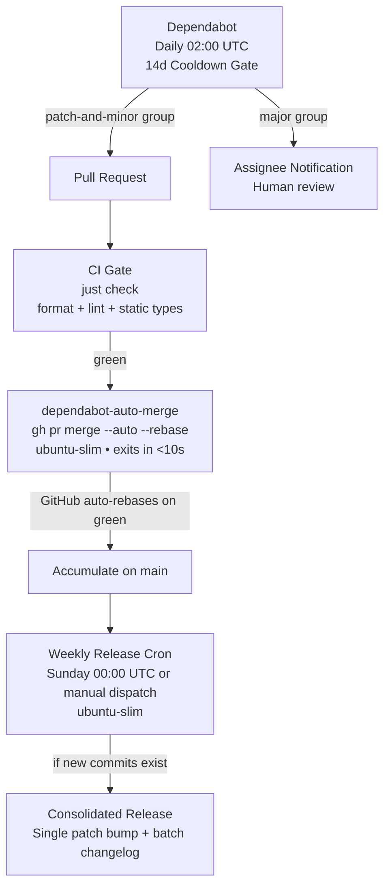

# Autonomous Upgrade

Autonomous dependency update and batched release pipeline: **Dependabot (daily + 14d cooldown) → `just check` CI Gate → Instant Auto-rebase (patch/minor) → Weekly Consolidated Release**.



## Hard Rules & Architecture

1. **Standard `just check` Single Contract**: The target project is assumed to use the `just` command runner with a `check` recipe (`just check`) that orchestrates all formatting, linting, tests, and static type checking. CI does **not** run multi-platform build steps. Target agents can rely on this single contract without project-specific build scaffolding.
2. **Supply Chain Defense (Mandatory 2-Week Cooldown)**: Dependabot runs **daily** to pick up mature packages immediately, but strictly enforces `cooldown: default-days: 14`. All newly published versions are quarantined for 14 days before an upgrade PR is created. This directly mitigates software supply chain attacks (e.g., account takeovers, poisoned point-releases, typosquatting), allowing registries and the security community time to detect and yank compromised releases.
3. **Split Dependency Groups (`patch-and-minor` vs `major`)**: Dependabot groups must separate `patch` and `minor` from `major` updates. This prevents a single breaking major update from blocking the autonomous merging of routine patches.
4. **Weekly Batched Releases (Zero Polling & Drastic Compute Savings)**: Rather than releasing on every individual PR (which would churn version numbers, burn runner minutes, and require fragile polling loops due to `GITHUB_TOKEN` event suppression), updates accumulate on `main` throughout the week. A scheduled weekly cron job generates a **single consolidated patch release** containing the combined changelog.
5. **Single-Core Runner Efficiency (`ubuntu-slim`)**: Except for `Check (just check)` (which uses `ubuntu-latest` for compiler/toolchain headroom), all orchestration workflows (`automerge` and `release`) use GitHub's single-core `ubuntu-slim` runner to minimize resource consumption and queue latency.
6. **Linear History & Rebase Only**: Repositories require rebase merges only (`allow_rebase_merge: true`, `allow_squash_merge: false`, `allow_merge_commit: false`).
7. **Release Concurrency Lock**: Releases use a concurrency group (`release-main`) with `cancel-in-progress: false` to ensure tag creation and releases are serialized without collision.

---

## Workflow Implementation

### 1. Configure Repository & Branch Protection

Run with `gh` CLI (repo admin permissions required):

```bash
# Enable auto-merge and rebase-only merges
gh repo edit <owner>/<repo> \
  --enable-auto-merge \
  --enable-rebase-merge \
  --delete-branch-on-merge

# Apply branch protection: strict 'Check (just check)' gate and linear history
gh api -X PUT "repos/<owner>/<repo>/branches/main/protection" \
  -H "Accept: application/vnd.github+json" \
  --input - <<'EOF'
{
  "required_status_checks": {
    "strict": true,
    "contexts": [
      "Check (just check)"
    ]
  },
  "enforce_admins": false,
  "required_pull_request_reviews": null,
  "restrictions": null,
  "required_linear_history": true,
  "allow_force_pushes": false,
  "allow_deletions": false,
  "allow_auto_merge": true
}
EOF
```

> **Settings Check**: Under **Settings → Actions → General → Workflow permissions**, verify **"Allow GitHub Actions to create and approve pull requests"** is checked.

---

### 2. File Templates

#### A. `.github/dependabot.yml`
Runs **daily** with **14-day supply-chain quarantine cooldown** and **isolated major groups**:

```yaml
version: 2
updates:
  - package-ecosystem: npm # Adapt: gomod, cargo, pip, etc.
    directory: "/"
    schedule:
      interval: daily
      time: "02:00"
    labels:
      - dependencies
    assignees:
      - <owner>
    commit-message:
      prefix: "chore(deps)"
    # Supply chain security: quarantine newly published versions for 14 days
    cooldown:
      default-days: 14
    groups:
      patch-and-minor:
        patterns:
          - "*"
        update-types:
          - "patch"
          - "minor"
      major:
        patterns:
          - "*"
        update-types:
          - "major"
    open-pull-requests-limit: 2
```

#### B. `.github/workflows/ci.yml`
Single `just check` gate. No build matrix:

```yaml
name: CI

on:
  pull_request:
    branches: [main]
  push:
    branches: [main]
  workflow_dispatch:

permissions:
  contents: read

jobs:
  check:
    name: Check (just check)
    runs-on: ubuntu-latest
    steps:
      - uses: actions/checkout@v4
      - uses: extractions/setup-just@v2
      # Insert any language setup needed by `just check` here (e.g. setup-go, setup-node)
      - name: Run verification
        run: just check
```

#### C. `.github/workflows/dependabot-auto-merge.yml`
Enables auto-merge for patch/minor updates and exits immediately in <10 seconds. No polling:

```yaml
name: Dependabot auto-merge

on:
  pull_request:
    branches: [main]

permissions:
  contents: write
  pull-requests: write

jobs:
  automerge:
    if: github.actor == 'dependabot[bot]' && contains(github.event.pull_request.labels.*.name, 'dependencies')
    runs-on: ubuntu-slim
    steps:
      - name: Fetch Dependabot metadata
        id: meta
        uses: dependabot/fetch-metadata@v2
        with:
          github-token: "${{ secrets.GITHUB_TOKEN }}"

      # Automerge patch and minor; major remains open for human review
      - name: Enable auto-merge for patch and minor
        if: steps.meta.outputs.update-type != 'version-update:semver-major'
        run: gh pr merge --auto --rebase "$PR_URL"
        env:
          PR_URL: ${{ github.event.pull_request.html_url }}
          GH_TOKEN: ${{ secrets.GITHUB_TOKEN }}
```

#### D. `.github/workflows/release.yml`
Weekly batched release. Runs every Sunday at 00:00 UTC (or on demand via `workflow_dispatch`). Checks if new commits exist before releasing:

```yaml
name: Release

on:
  schedule:
    - cron: '0 0 * * 0' # Weekly: Sunday 00:00 UTC
  workflow_dispatch:
    inputs:
      release_version:
        description: 'Explicit version (e.g. 0.1.0) - leave empty for auto patch bump'
        required: false
        type: string
        default: ""

concurrency:
  group: release-main
  cancel-in-progress: false

permissions:
  contents: write

jobs:
  release:
    name: Tag & Release
    runs-on: ubuntu-slim
    steps:
      - uses: actions/checkout@v4
        with:
          fetch-depth: 0

      - name: Check for new commits since last release
        id: check_commits
        run: |
          LATEST_TAG="$(git describe --tags --abbrev=0 2>/dev/null || echo '')"
          if [ -n "$LATEST_TAG" ]; then
            COMMIT_COUNT=$(git rev-list "${LATEST_TAG}..HEAD" --count)
            echo "Commits since $LATEST_TAG: $COMMIT_COUNT"
            if [ "$COMMIT_COUNT" -eq 0 ] && [ -z "${{ inputs.release_version }}" ]; then
              echo "skip=true" >> "$GITHUB_OUTPUT"
              echo "No new commits since $LATEST_TAG. Skipping release."
              exit 0
            fi
          fi
          echo "skip=false" >> "$GITHUB_OUTPUT"

      - name: Compute Next Version
        if: steps.check_commits.outputs.skip != 'true'
        id: version
        run: |
          if [ -n "${{ inputs.release_version }}" ]; then
            echo "tag=v${{ inputs.release_version }}" >> "$GITHUB_OUTPUT"
          else
            LATEST_TAG="$(git describe --tags --abbrev=0 2>/dev/null || echo 'v0.0.0')"
            RAW="${LATEST_TAG#v}"
            IFS='.' read -r major minor patch <<< "$RAW"
            NEXT_VERSION="v${major:-0}.${minor:-1}.$(( ${patch:-0} + 1 ))"
            echo "tag=$NEXT_VERSION" >> "$GITHUB_OUTPUT"
          fi

      - name: Publish Consolidated Release
        if: steps.check_commits.outputs.skip != 'true'
        uses: softprops/action-gh-release@v2
        with:
          tag_name: ${{ steps.version.outputs.tag }}
          generate_release_notes: true
```

---

## Target Project Contract

To integrate this skill into any repository, the project must satisfy:
1. **`just check` recipe**: A runnable recipe in the root `justfile` executing formatting, linting, tests, and static analysis.
2. **Exact Check Name**: The branch protection rule must match `"Check (just check)"`.
3. **Ecosystem Configuration**: Set `package-ecosystem` and `directory` in `.github/dependabot.yml` to target the repository's dependency manifests.
