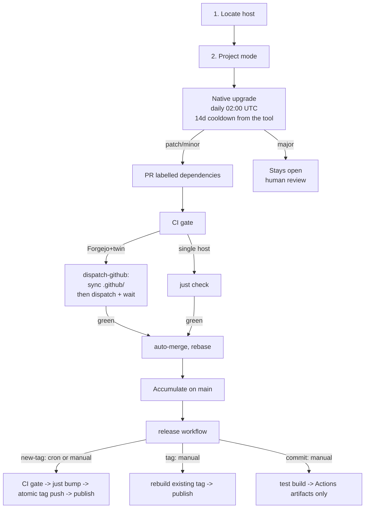

# Autonomous Upgrade

Pipeline: **native upgrade (daily + 14d cooldown) → CI gate → auto-rebase → `release` (3 targets: new-tag, tag, commit)**.

Host model:

| Setup | Source of truth | Twin | Workflows live in |
|---|---|---|---|
| GitHub-hosted repo | `origin` on github.com | none | `.github/workflows/` |
| Self-hosted Forgejo, no twin | Forgejo origin | none | `.forgejo/workflows/` |
| Self-hosted Forgejo + GitHub twin | Forgejo origin | **throwaway** public mirror, free runners only | `.forgejo/workflows/` (triggers) + `.github/workflows/` (**authored in the source repo**, synced by the dispatch action before every run) |

The twin holds no source: it is regenerated from the source repo's `.github/`
on every dispatch. Never author, edit, or commit directly in the twin — any
hand edit there is overwritten by the next sync. The twin's
`.github/workflows/` in the source repo is what Semgrep/Gitleaks scan;
suppressions and pins live there, once.

## Do these three things first, in order

| # | Gate | Why it blocks everything after |
|---|---|---|
| 1 | **Locate the host** — `git remote -v` | Decides `.github/` vs `.forgejo/`, runner labels, `gh` vs native AGit, and whether a GitHub twin exists |
| 2 | **Ask the project mode** — maintenance or active | Decides whether `release.yml` gets `on.schedule` (active projects track milestones in an optional roadmap) |
| 3 | **Consult the owner** on the checklist in `references/decisions.md` | The rest are baselines to adapt, not mandates |

Never assume github.com. Never write a weekly cron for a project under active
development.

```mermaid
flowchart TD
    Z[1. Locate host] --> Y[2. Project mode]
    Y --> A[Native upgrade<br/>daily 02:00 UTC<br/>14d cooldown from the tool]
    A -->|patch/minor| B[PR labelled dependencies]
    A -->|major| C[Stays open<br/>human review]
    B --> D[CI gate]
    D -->|Forgejo+twin| D2[dispatch-github:<br/>sync .github/<br/>then dispatch + wait]
    D -->|single host| D3[just check]
    D2 -->|green| E[auto-merge, rebase]
    D3 -->|green| E
    E --> F[Accumulate on main]
    F --> G[release workflow]
    G -->|new-tag: cron or manual| H[CI gate -> just bump -> atomic tag push -> publish]
    G -->|tag: manual| I[rebuild existing tag -> publish]
    G -->|commit: manual| J[test build -> Actions artifacts only]
```

## Reference files

Read the file for the task at hand; do not read all four.

| File | Read when |
|---|---|
| `references/decisions.md` | The customization checklist — host, release model, artifacts, runner budget |
| `references/hosts.md` | Writing any workflow: GitHub vs Forgejo differences, the twin-repository pattern, branch protection |
| `references/ecosystems.md` | Setting the 14-day cooldown, or choosing whether an ecosystem qualifies at all |
| `references/workflows.md` | The four YAML templates: deps, CI, auto-merge, release |

## Hard rules

These are not negotiable. Rationale is in `references/decisions.md`.

1. **Consult the owner before applying.** No universal CI/CD flow. Record agreed
   choices and deviations in the PR/conversation — never a committed decision file.
2. **CI gate shape follows the host.** Single-host repos: one `just check`, no
   build matrix. Forgejo+twin repos: the CI workflow runs `just check` **plus
   the security scans in parallel** — Gitleaks (secrets), Semgrep (SAST),
   Trivy (OS packages + misconfigurations), OSV-Scanner (deps). Security
   scanning is a GitHub-runners-only concern: it runs on the twin, never on
   self-hosted Forgejo (no Docker images, no registry egress, no runner
   minutes there). Building artifacts is always the release workflow's job.
3. **14-day cooldown, enforced by the package manager itself.** Never re-implement
   the age filter as a shell script — the tool's own gate also covers transitive
   dependencies. If an ecosystem has no native gate, that project does not get
   autonomous bumps.
4. **Dependabot for GitHub Actions only.** On GitHub-hosted repos, Dependabot is
   used exclusively for `package-ecosystem: "github-actions"` to keep workflow
   actions up to date, and nothing else. Code dependencies are upgraded through
   native package managers (`bun update`, `cargo update`, `ncu`).
5. **Split patch/minor from major**, so a breaking major cannot block routine merges.
6. **Weekly releases only in maintenance mode.** Active development gets
   `workflow_dispatch` alone. The unified `release.yml` workflow provides 3
   targets: `new-tag` (default/cron: CI gate + bump + tag + publish), `tag`
   (rebuild existing tag), and `commit` (test build, Actions artifacts only).
7. **Cheapest single-core runner for orchestration** (`ubuntu-slim` on GitHub, the
   owner's self-hosted label on Forgejo). Full runners only for `just check` and
   artifact builds.
8. **Rebase-only, linear history.** No squash, no merge commits.
9. **Concurrency locks:** `release-main` (`cancel-in-progress: false`) for
   releases; dynamic per-branch `${{ github.workflow }}-${{ github.ref }}`
   (`cancel-in-progress: true`) for CI to safely cancel stale runs.
10. **Verify action runtimes match the runner.** `using: node24` actions fail on
    lean images like Alpine. Prefer shell-only composites on self-hosted runners.
11. **Push the version commit and its tag in one `git push`**, and never tag a
    commit whose manifest still carries the old version.
12. **Self-owned action refs get `nosemgrep`, third-party refs get SHA pins.**
    The `github-actions-mutable-action-tag` rule fires on every `uses: …@<tag>`;
    on refs the owner controls on both ends (own Forgejo actions repo, own
    GitHub org) a tag can only be repointed by the owner, so suppress with a
    bare `# nosemgrep` comment (verified: the `rule-id` form is silently ignored
    on YAML `uses:` lines by current Semgrep). Third-party refs keep the rule
    live — pin them to full SHAs instead.
13. **No `${{ }}` interpolation inside `run:` blocks.** Move every workflow
    context value (`inputs.*`, `steps.*.outputs.*`, `needs.*.outputs.*`,
    `secrets.*`) into the step's `env:` block and reference `$VAR` in shell.
    `if:`/`with:`/`env:` interpolation is fine — the injection sink is the shell.
    Verified clean by scanning `run: |` blocks for `${{` before committing.

## Project contract

A repo qualifies only if all of these hold:

1. A root `justfile` with:
   - `check`: executes formatting, linting, tests, and static analysis.
   - `bump version`: updates the package manager's manifest (package-agnostic, see `references/ecosystems.md`).
2. Branch protection requires exactly `"Check (just check)"`.
3. The package manager has a native cooldown gate, configured to 14 days
   (see `references/ecosystems.md`).
4. The owner has stated the project mode.
5. Release artifacts are decided and implemented; CI stays build-free.
