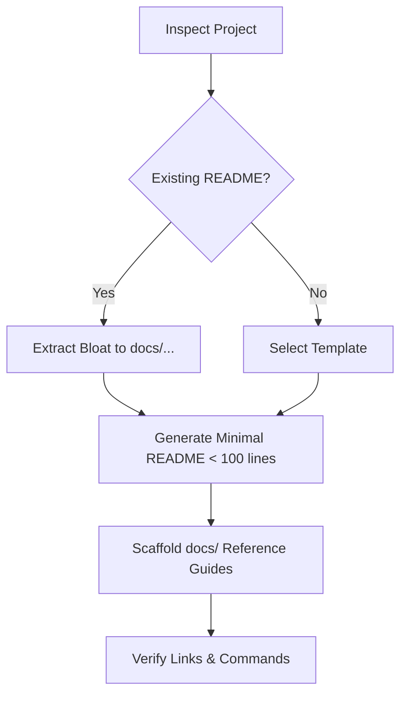

# README Skill

A project's `README.md` is a **high-conversion landing page**, not an exhaustive manual. It tells the reader what the project does and gives them working commands in under 60 seconds. Everything else belongs in `docs/`.

## Triggers

- Slash commands: `/readme`, `/readme-template`, `/init-readme`
- Natural language: "create a readme", "standardize the readme", "clean up the readme", "make a minimal readme"

## Workflow

1. **Inspect project** — identify project type (CLI binary, web service, library, dotfiles), package manager, build command, and primary binary name.
2. **Audit or Extract** — if a `README.md` already exists:
   - Keep: the one-sentence purpose, 3-step quickstart, and primary flags.
   - Extract to `docs/`: configuration tables with more than 5 rows, deep architectural essays, deployment scripts, or long contributing steps.
3. **Generate root `README.md`** — apply `references/template.md`. Keep total length under 100 lines.
4. **Scaffold `docs/`** — create missing target files using skeletons from `references/docs-layout.md` for any extracted content.
5. **Verify** — ensure all links resolve locally, commands work, and badge URLs use valid shields syntax.

## Reference Files

Read the relevant file for the active task; do not load both:

| File | Purpose |
|---|---|
| `references/template.md` | The universal golden template for root `README.md` files (covers 99% of use cases). |
| `references/docs-layout.md` | Directory layout and skeleton templates for offloaded files in `docs/` (`configuration.md`, `architecture.md`, `deployment.md`, `development.md`). |

## Hard Rules

1. **Max 100 lines for root `README.md`:** If the file exceeds 120 lines, you are writing manual pages instead of a landing page. Offload immediately.
2. **One-sentence value proposition:** The first sentence under the header must state in plain language what the project is, who it is for, and the outcome it delivers. No jargon.
3. **Max 3–5 badges on one line:** Only functional badges (CI status, latest release tag, license). Never allow badge lines to wrap.
4. **Sub-60s Quick Start:** Exactly 3 steps max: Install → Run → Verify. Commands must be copy-paste ready with zero hidden prerequisites.
5. **Outcome-focused highlights:** Exactly 3–5 bullet points. State user outcomes (speed, safety, ease), never implementation trivia (e.g. "Uses Tokio 1.2" is forbidden).
6. **No configuration dumps:** Never place more than 5 CLI flags or environment variables in `README.md`. More than 5 items MUST live in `docs/configuration.md`.
7. **No deep architecture treatises & use Mermaid:** Root architecture gets a compact Mermaid diagram or 2 sentences max. Never use ASCII art. Deep explanations belong in `docs/architecture.md`.
8. **No placeholder debt & clean roadmap:** Never leave `TODO`, `WIP`, or empty sections in published READMEs. In-flight work for active projects belongs in an optional `## Roadmap` checklist (max 3–5 items), never in scattered scratch files. Omit the section once in maintenance mode.
