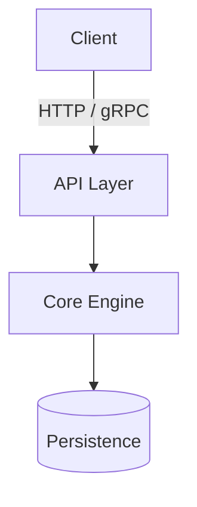

# `docs/` Offloading Standards & Skeletons

Offload anything beyond the 60-second landing page to dedicated files inside `docs/`. This keeps `README.md` under 100 lines and isolates changes to specific docs.

## File Map

| File | Read/Write when |
|---|---|
| `docs/configuration.md` | Configuration flags, environment variables, full YAML/JSON/TOML schema, defaults. |
| `docs/architecture.md` | Module boundaries, state machines, networking protocols, design tradeoffs. |
| `docs/deployment.md` | Production installation, Docker Compose, systemd units, reverse proxy, backups. |
| `docs/development.md` | Toolchains, building from source, running tests, linters, release procedures. |

---

## 1. `docs/configuration.md`

Use when the project has more than 5 configuration options, environment variables, or nested config files.

````markdown
# Configuration Reference

## Environment Variables

| Variable | Default | Required | Description |
|---|---|---|---|
| `PORT` | `8080` | No | Port for the HTTP service |
| `DATABASE_URL` | None | Yes | PostgreSQL connection string |
| `LOG_LEVEL` | `info` | No | Logging level: `debug`, `info`, `warn`, `error` |

## Configuration File

The project loads `config.yaml` by default. Example:

```yaml
server:
  host: 0.0.0.0
  port: 8080

storage:
  path: /var/lib/app/data
  sync_interval_seconds: 60
```

## Options Matrix

| Key | Type | Default | Description |
|---|---|---|---|
| `server.host` | string | `0.0.0.0` | Bind IP address |
| `server.port` | integer | `8080` | Bind TCP port |
````

---

## 2. `docs/architecture.md`

Use when documenting system design, data flows, invariants, or component boundaries.

````markdown
# Architecture

## Overview

High-level description of how components interact and what guarantees the system maintains.



## Core Components

- **API Layer:** Handles authentication, rate limiting, and request validation.
- **Core Engine:** Executes domain logic and state transitions without IO dependencies.
- **Persistence:** Manages atomic updates to storage and cache.

## Invariants & Guarantees

- **Crash-consistency:** All state changes commit to disk before answering the client.
- **Idempotency:** Re-running a command with the same request ID causes no side effects.
````

---

## 3. `docs/deployment.md`

Use when providing production setup, containers, or process supervisors.

````markdown
# Deployment & Operations

## Docker Compose

```yaml
services:
  app:
    image: ghcr.io/<owner>/<repo>:latest
    restart: unless-stopped
    ports:
      - "8080:8080"
    volumes:
      - ./data:/var/lib/app/data
    environment:
      - LOG_LEVEL=info
```

## Systemd Service

```ini
[Unit]
Description=<Project Name>
After=network.target

[Service]
Type=simple
User=app
ExecStart=/usr/local/bin/<project> run --config /etc/<project>/config.yaml
Restart=on-failure
RestartSec=5s

[Install]
WantedBy=multi-user.target
```

## Health Checks & Backup

- **Health:** `curl -f http://localhost:8080/health || exit 1`
- **Backup:** Copy `/var/lib/app/data` during maintenance windows or use the built-in backup CLI.
````

---

## 4. `docs/development.md`

Use when describing contributor prerequisites, build steps, test suites, and linting.

````markdown
# Development Guide

## Prerequisites

- Required language toolchain (e.g. Go 1.23+, Rust 1.80+, Node.js 22+)
- `just` task runner

## Build & Test

```bash
# Install dependencies and compile
just build

# Run unit and integration tests
just test

# Format and lint
just check
```

## Contribution Workflow

1. Branch off `main`: `git checkout -b feat/my-feature`.
2. Ensure `just check` passes cleanly.
3. Open a PR with clear user outcome in the description.
````
