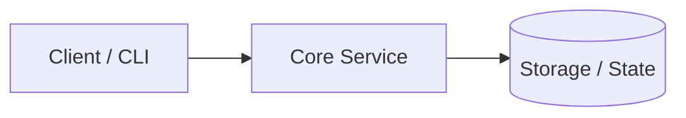

# Universal Project README Template

Copy and adapt this template for the repository root `README.md`. Keep the final output under 100 lines.

````markdown
<div align="center">

# <project-name>

**<One clear sentence: what this project does and the outcome it provides. Plain words, no jargon.>**

[](https://github.com/<owner>/<repo>/actions)
[](https://github.com/<owner>/<repo>/releases)
[](LICENSE)

<!-- Optional: 1-line demo image or animated terminal recording (VHS/GIF) -->
<!--  -->

</div>

---

## Quick Start

Get running in less than 60 seconds:

```bash
# 1. Install
curl -fsSL https://get.<project>.dev | bash

# 2. Start
<project> init && <project> start
```

Visit `http://localhost:<port>` to verify.

## Highlights

- **<Outcome 1>** — <Plain-language benefit, e.g. "Instant startup under 15ms with low memory footprint.">
- **<Outcome 2>** — <Concrete capability, e.g. "Zero configuration with sensible production defaults.">
- **<Outcome 3>** — <Reliability or ease, e.g. "Single static binary with no external runtime dependencies.">

## Common Options

```bash
# Typical command for 99% of daily use
<project> run --config config.yaml
```

| Option | Default | Description |
|---|---|---|
| `-c, --config <file>` | `config.yaml` | Path to configuration file |
| `-p, --port <port>` | `8080` | Port to bind server |
| `-v, --verbose` | `false` | Enable verbose diagnostic logging |

For all environment variables, full YAML schema, and advanced flags, see **[Configuration Reference](docs/configuration.md)**.

## Architecture



For component boundaries, internal pipelines, and design decisions, see **[Architecture Guide](docs/architecture.md)**.

## Roadmap

<!-- Optional: for active projects. Omit once in maintenance mode. -->
- [x] **<Shipped milestone>** — <Brief description of what landed.>
- [ ] **<In-flight milestone>** — <Current focus before next tag.>
- [ ] **<Final milestone>** — <Feature-freeze criteria to cut over to maintenance mode.>

## Documentation

- **[Configuration](docs/configuration.md)** — Environment variables, settings schema, and flag reference.
- **[Architecture](docs/architecture.md)** — System boundaries, data structures, and invariants.
- **[Deployment](docs/deployment.md)** — Docker Compose, systemd service units, and production guidelines.
- **[Development](docs/development.md)** — Build steps, running tests, and contribution workflow.

## License

[MIT](LICENSE)
````

---

## Customization Guidelines

- **For CLI tools:** Quick Start should be `brew install <tool>` or `curl ... | bash` followed by `<tool> --help`.
- **For Libraries / SDKs:** Replace "Common Options" with a 5-line code snippet showing `import` and standard invocation.
- **For Containers / Services:** Quick Start should be `docker compose up -d` followed by `curl localhost:<port>/health`.
- **For Dotfiles / Config Repos:** Quick Start should be the bootstrap one-liner followed by verification commands.
- **For active projects:** An optional `## Roadmap` section tracks in-flight milestones (max 3–5 items); checking all items signals readiness to cut over to maintenance mode.
